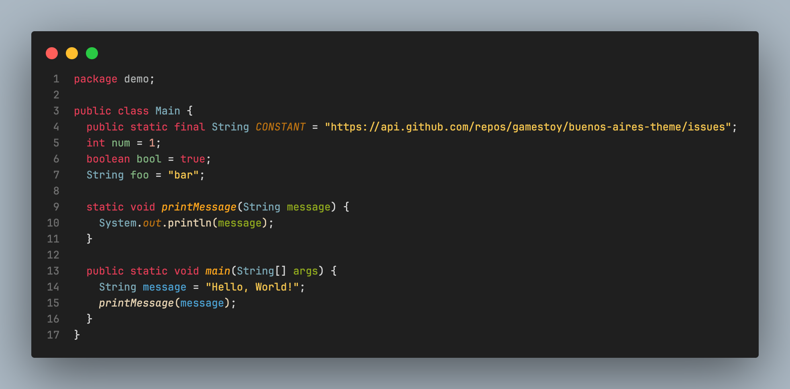
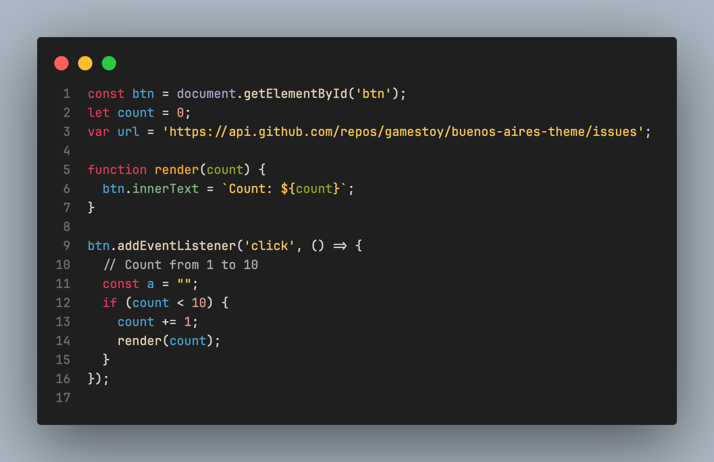
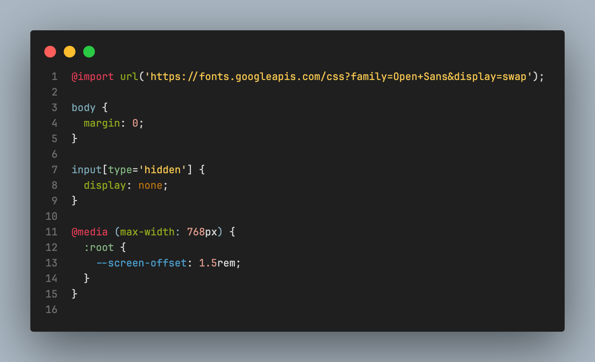
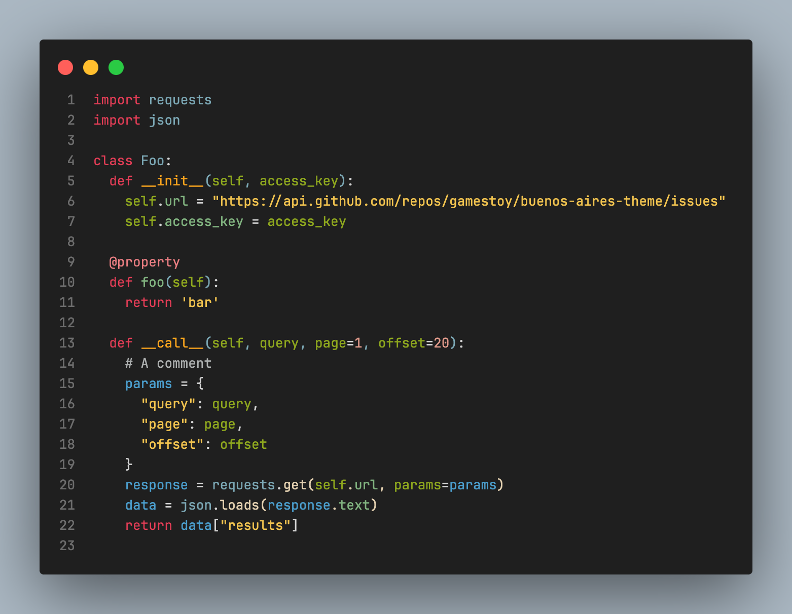

<div align="center">


</div>

An eclectic dark theme for [Visual Studio Code](https://code.visualstudio.com), inspired by Buenos Aires and the [Codemos Modern](https://github.com/Codemos-Inc/Codemos-Modern) theme.

---


## ⌨️ Installation

1. Go to `Extensions`
2. Search for `Buenos Aires` and install it.
3. Go to `Color Themes` and choose `Buenos Aires` as the color theme or `CMD + Shift + P` and enter Command `> color theme` and choose `Buenos Aires`.

## 📷 Screenshots

### Java



### Javascript



### CSS



### Python



## 唥 Language support

The theme is optimized for many languages:

- `Java`
- `Javascript`
- `JSX`
- `Python`
- `HTML`
- `MarkDown(.md)`
- `JSON`
- `XML`
- `YAML`

---

## Development
Install dependencies
```
npm install
```
Update themes and build VSIX package
```
npm run build && npm run package
```